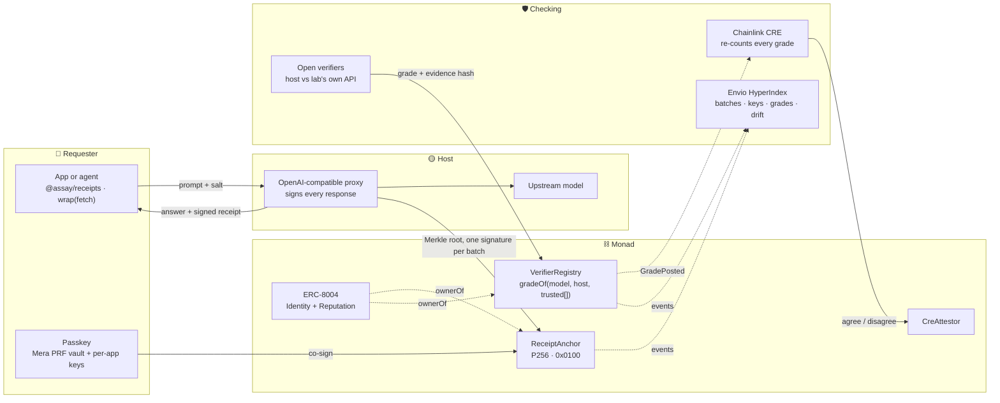

<div align="center">


# Assay

### Signed receipts for AI responses, anchored on Monad

**The host signs what it served. Monad holds the proof. Open verifiers grade the host. You decide whose grades count.**

[](https://assay-ten-xi.vercel.app)
[](https://assay.gitbook.io/assay-docs)
[](https://testnet.monadvision.com/address/0x63e4F42E6d254ed6aAE735F9F4169BbFd12c1a24)
[](#security)
[](https://github.com/trudransh/Assay/actions)
[](LICENSE)

<br />

| 💬 **Ask, get a receipt** | 🧾 **A live receipt** | 🖥️ **Host profile** | 📚 **Docs** | 📜 **Spec** | 📊 **Report** |
|:--:|:--:|:--:|:--:|:--:|:--:|
| [/app/#ask](https://assay-ten-xi.vercel.app/app/#ask) | [0x9a166cac…](https://assay-ten-xi.vercel.app/app/#r/0x9a166cacb2ffe4784ad556f69b690b7cebf71150f737a5a3c324f9e98e7907e5) | [agent 1962](https://assay-ten-xi.vercel.app/app/#hosts/1962) | [gitbook](https://assay.gitbook.io/assay-docs) | [SPEC.md](SPEC.md) | [REPORT_v0](report/REPORT_v0.md) |

</div>

---

## Why

You call an open-weight model through someone else's host, and the text comes back with no proof of who served it.

The hosts don't all serve the same thing. On 26 Sep 2026, OpenRouter listed **735 open-weight endpoints**. **39% don't state their precision** and 15% declare 4-bit. GLM-5.3 alone has **37 endpoints**: 16 state no precision, and output prices run from **$1.19 to $8.80** per million tokens. The same weights score differently depending on who serves them. Olly measured DeepSeek V4 Flash at **90% on GPQA** through DeepSeek's own API and **75%** on another host. Cline measured GLM-5.2 at 74.2% on one host and 61.8% on default routing.

The checks that exist stay where they were made. A router's grades only work inside that router, and a lab's verifier only covers its own models. Nothing travels with the answer.

**Assay is the part that travels.** Every response gets a receipt. Hosts can't deny what they signed, verifiers grade hosts in public against the lab's own API, and anyone can check both without trusting us.

## What a receipt proves

| Mark | What it means | Checked by |
|---|---|---|
| 🟡 **HOST** | The host's ERC-8004 identity signed this exact response (ES256 over canonical JSON) | Your browser, against the host's published JWKS |
| ⚪ **MODEL** | The model the host claimed to serve | Signed into the receipt, so a false claim is a signed false claim |
| 🟣 **ANCHOR** | The receipt is in a batch whose Merkle root the host anchored on Monad | Monad: `ReceiptAnchor` checks the batch signature with the P256 precompile |
| 🩷 **YOU** | The person who asked co-signed the receipt with a passkey or a per-app key | Monad: WebAuthn through the P256 precompile, or `ecrecover` for per-app keys |

**What it doesn't prove: which weights actually ran.** A host can still sign a lie. With Assay that lie is signed, anchored and graded in public. Re-execution and TEE attestation are next on the [roadmap](https://assay.gitbook.io/assay-docs/resources/roadmap).

Your prompt and the answer never go onchain. The receipt holds salted hashes, and you keep the salt.

## How it fits together



| Building block on Monad | What Assay does with it |
|---|---|
| **P256 precompile (`0x0100`)** | Host keys, cloud KMS keys and passkeys all sign with P-256. `ReceiptAnchor` checks the host's batch signature and the requester's WebAuthn co-signature onchain, at about 61k gas per anchor and 73k per co-sign. Two canary tests fail if the precompile ever goes missing and OpenZeppelin falls back to its ~250k-gas Solidity path. |
| **ERC-8004** | Every host and every verifier is an ERC-8004 agent. Grades follow the identity (`keccak256("erc8004:<chain>:<id>")`), not the signing key, so rotating a key can't wipe a bad grade. The indexer counts a complaint only if its sender co-signed the receipt it cites. |
| **Cheap, fast blocks** | One anchor per batch: about 0.0001 MON per receipt in a 64-receipt batch, so small batches can go onchain often (every 30 seconds on the reference host). |

## Thirty seconds of code

```ts
import { wrap, hostGradeCheck, verifyReceipt, GradeGateError } from "@assay/receipts";

// Refuse a host before sending (or paying) unless verifiers you trust grade it "pass"
const ask = wrap(fetch, {
  gate: {
    check: hostGradeCheck(`${HOST}/v1/grade`, { model: "z-ai/glm-5.3", host: "erc8004:10143:1962", verifiers: [MY_VERIFIER] }),
    allow: ["pass"],
  },
});

const { json, receipt, salt } = await ask(`${HOST}/v1/chat/completions`, {
  method: "POST",
  headers: { "content-type": "application/json" },
  body: JSON.stringify({ messages }),
}); // throws GradeGateError, and sends nothing, if the gate says no

// Anyone, later: every check on its own, each with the exact call that reproduces it
const result = await verifyReceipt({ body: receipt.body, jws: receipt.jws, jwks, proof, root, onchain: { client, anchor }, salt, output, messages });
result.checks;              // { jws, hash, kid, merkle, anchored, outputCommit, promptCommit, cosigned }
result.reproduce.anchored;  // { kind: "contract-call", address, function, args } → paste into cast
```

`@assay/receipts` is the `sdk/` workspace package. [SDK reference](https://assay.gitbook.io/assay-docs/for-developers/sdk) · [Quickstart](https://assay.gitbook.io/assay-docs/getting-started/quickstart)

## Live on Monad testnet (chain 10143)

| Contract | Address | Deploy |
|---|---|---|
| **ReceiptAnchor** | [`0x63e4F42E6d254ed6aAE735F9F4169BbFd12c1a24`](https://testnet.monadvision.com/address/0x63e4F42E6d254ed6aAE735F9F4169BbFd12c1a24) | [tx](https://testnet.monadvision.com/tx/0x32d12f86ec3dca22d7b25ec33985eeda69f94e7299592728b16b2896715a1022) |
| **VerifierRegistry** | [`0x7755818dc08659D2A3A66FA3ddb1Ce636c145C91`](https://testnet.monadvision.com/address/0x7755818dc08659D2A3A66FA3ddb1Ce636c145C91) | [tx](https://testnet.monadvision.com/tx/0x246d2ef1d317d9ef4dc21318ef16a60f50bc1e4818685058228669f0b48abfd8) |
| **CreAttestor** | [`0xB4A1CB9e40aDa44570Ae790430C23876d460deDC`](https://testnet.monadvision.com/address/0xB4A1CB9e40aDa44570Ae790430C23876d460deDC) | [tx](https://testnet.monadvision.com/tx/0x0d2dc7b2fc51c718226a28bc2b0027a94d74409b1060f47b795d9582ab6bb00a) |

All three are verified on Sourcify (exact match).

| Onchain so far | Proof |
|---|---|
| ⛓️ First real receipt anchored: Gemma 4 31B through the reference host (agent 1962). `verifyReceipt` returns true | [tx `0x41f73bca…`](https://testnet.monadvision.com/tx/0x41f73bcaa5270d16df2cbdafc920b0fa7f6e87890f968acece7f3c6a99a7a867) |
| 📈 First grade: Gemma 4 31B on OpenRouter's Google AI Studio route, 6/6, 95% interval 60.96% to 100% | [tx `0xbae5c59e…`](https://testnet.monadvision.com/tx/0xbae5c59e14a0f0653f41096323c6eae7f0e95533458027ef25b3823502ef88e0) |
| 🎯 Reference grade: same model on Google's own API, 19/19, 83.18% to 100% | [tx `0x137f910d…`](https://testnet.monadvision.com/tx/0x137f910d3e2181a9b2930170d47126370ae282e8dab7f8f91287b6aaa1dd16f6) |
| 🪪 Host agent 1962 key set · verifier agent 1981 registered | [`0xcfd45e43…`](https://testnet.monadvision.com/tx/0xcfd45e4304e7de3c0337eb83288d657e978efc2a0df614c74cfb1a9adcc7b8b4) · [`0x752c6fe5…`](https://testnet.monadvision.com/tx/0x752c6fe566c60f390a79c449c812afc1fcd8b6802b1877da7bdc6231da52d178) |

Both grades read `warn` until a host has 30 samples. The reference host runs at https://34-45-1-81.sslip.io and anchors each batch within seconds. Every address and tx is in [`docs/deployments.md`](docs/deployments.md).

## Integrations

<table>
<tr>
<td width="50%" valign="top">

### 🔎 Envio HyperIndex
**Live on Envio Cloud**

Indexes every Assay contract plus ERC-8004 identity and reputation. Drift events, per-model leaderboards and key rotations are computed in handlers. The receipt page reads the batch, **the key that signed that batch** and the co-signs in one GraphQL query. The contract only stores a host's current key, so the indexer is the only place the old signing key lives.

Proof: [`indexer/`](indexer/) · [endpoint](https://indexer.dev.hyperindex.xyz/7c1753d/v1/graphql) · 22 handler tests

</td>
<td width="50%" valign="top">

### 🔗 Chainlink CRE
**`grade-recheck` workflow**

One verifier could lie about a grade. On every `GradePosted`, the workflow downloads the evidence, checks its sha256, recounts pass and total, recomputes the Wilson interval, and writes agree or disagree to `CreAttestor`. On the real grade it **agrees**. On an inflated replay (claims 10/10, the logs say 8/10) it returns **`agree=false`**.

Proof: [`docs/evidence/cre-simulate-grade-recheck.txt`](docs/evidence/cre-simulate-grade-recheck.txt) · [`cre/`](cre/) · 27 tests

</td>
</tr>
<tr>
<td width="50%" valign="top">

### 🗝️ Mera PRF
**One passkey, many keys**

The passkey's PRF output derives an AES-GCM key for a vault that keeps your receipts and salts as ciphertext only, per-receipt reveal keys for showing one answer to one person, and per-app secp256k1 requester keys that can't be linked across apps. Nothing derived is stored, and a second device with the same passkey re-derives it all. Per-app keys co-sign onchain with `cosignK`.

Proof: [`web/src/lib/vault.ts`](web/src/lib/vault.ts) · [`web/src/mera.ts`](web/src/mera.ts) · [docs](https://assay.gitbook.io/assay-docs/integrations/mera)

</td>
<td width="50%" valign="top">

### 🪪 ERC-8004
**Identity, reputation, receipts**

Hosts and verifiers are ERC-8004 agents, and `VerifierRegistry` re-checks ownership on every grade, because an identity can be sold. The indexer counts feedback against a host only if the sender co-signed the receipt it cites, so complaints come from people who were actually served.

Proof: `test_post_afterIdentityTransferred_reverts` · 3 fork tests against the real registry

</td>
</tr>
<tr>
<td width="50%" valign="top">

### 🛡️ MonadGuard
**Same receipt format, verified both ways**

MonadGuard checks the tool, Assay checks the model host that answered. Both sign ES256 over JCS with keys in a JWKS. Assay's verifier passes MonadGuard's mainnet receipts, and MonadGuard's `verify-foreign.mjs` passes ours with 10 of 10 checks, including a byte-for-byte JCS match. Each side pins the other's receipts as offline CI fixtures.

Proof: [`docs/interop/`](docs/interop/) · `sdk/test/interop.test.ts`

</td>
<td width="50%" valign="top">

### 📜 Mandate
**Only pay for inference from graded hosts**

A mandate bounds how much an agent spends. [PR #12](https://github.com/aliveevie/mandate/pull/12) adds `@ibxlab/mandate/assay`, so an agent under a mandate only pays inference hosts that verifiers it trusts grade `pass`. One view call to `gradeOf`, fails closed, no new dependencies, 10 tests.

Proof: [aliveevie/mandate#12](https://github.com/aliveevie/mandate/pull/12)

</td>
</tr>
</table>

## Security

The threat model maps every attack to the test that blocks it: [docs](https://assay.gitbook.io/assay-docs/security/threat-model).

| Property | Proof (Foundry) |
|---|---|
| A host can't anchor with a key that isn't its own, or replay a batch | `test_anchor_wrongKey_reverts` · `test_anchor_replay_reverts` |
| A signature can't move to another chain or deployment, and the count can't be changed | `test_anchor_otherDeployment_reverts` · `test_anchor_countTampered_reverts` |
| One host can't front-run another host's root | `test_anchor_otherHostSameRoot_doesNotBlock` |
| A receipt only verifies under the host that anchored it | `test_verifyReceipt_otherHostsAnchor_false` |
| A stranger co-signing first can't block or impersonate the requester | `test_cosign_otherKeyFirst_doesNotBlock` · `test_cosignK_otherSignerFirst_doesNotBlock` |
| A passkey co-sign needs user verification and low-s | `test_cosign_missingUV_reverts` · `test_cosign_highS_reverts` |
| Key rotation keeps old anchors valid, and grades don't follow the key | `test_setHostKey_rotation_keepsOldAnchors` · `test_gradeOf_otherHostKeyIsSeparate` |
| Stale grades and sold identities can't post | `test_post_staleGrade_reverts` · `test_post_afterIdentityTransferred_reverts` |
| Only our CRE workflow, through the forwarder, can write attestations | `test_onReport_nonForwarder_reverts` · `test_onReport_wrongWorkflowId_reverts` |
| The P256 precompile is live, never the 250k-gas fallback | `test_precompile_knownVector_returnsOne` · `test_valid_usesPrecompile_gasBound` |

| Package | Tests |
|---|---|
| Contracts (Foundry) | 99 + 3 fork tests against the real ERC-8004 registry |
| SDK `@assay/receipts` | 133, including cross-implementation checks of MonadGuard's receipts |
| Host | 49, plus a 16/16 end-to-end run on a local chain in CI |
| Web app | 68 |
| Grader (Python) | 43 |
| Envio indexer | 22, plus the HyperSync stats script |
| Chainlink CRE workflow | 27 |
| **Total** | **442**, across 6 CI workflows |

TypeScript and Solidity check each other: the SDK generates the signatures and Merkle proofs that the Foundry tests verify.

## Repository

| Path | Contents |
|---|---|
| [`contracts/`](contracts/) | Foundry: `ReceiptAnchor`, `VerifierRegistry`, `CreAttestor`, tests, fork tests, deploy scripts |
| [`sdk/`](sdk/) | `@assay/receipts`: receipts, salted commits, ES256 signing, Merkle batches, `verifyReceipt`, passkeys, `wrap(fetch)` with the grade gate, `gradeOf` |
| [`host/`](host/) | `@assay/host`: OpenAI-compatible proxy (Hono) that signs, batches and anchors, relays co-signs, serves `/v1/grade` |
| [`web/`](web/) | Landing page plus app: verify, receipt pages, ask and co-sign, grades, Mera vault (Vite, plain TypeScript) |
| [`indexer/`](indexer/) | Envio HyperIndex: anchors, keys, co-signs, grades, drift, leaderboards, ERC-8004 feedback |
| [`cre/`](cre/) | Chainlink CRE `grade-recheck` workflow and its simulations |
| [`harness/`](harness/) | The grader (Python, stdlib only): probes hosts against the lab's API, exports grades and evidence |
| [`report/`](report/) | Who's actually serving your model? Report v0 |
| [`docs/`](docs/) · [`gitbook/`](gitbook/) | Deployments, evidence, threat model; the GitBook site |

## Run it locally

You need Node 22+, pnpm (`corepack enable`) and Foundry 1.7+.

```bash
git clone --recurse-submodules https://github.com/trudransh/Assay.git && cd Assay && pnpm install
cd contracts && forge test -vv && cd ..          # contracts
pnpm -r test                                      # sdk, host, web
pnpm --filter @assay/host dev                     # host on :8787 (copy .env.example to .env first)
pnpm --filter web dev                             # app on :5173
```

Try the grader. The dry run needs no key and prints the cost first:

```bash
python3 harness/assay_probe.py --model z-ai/glm-5.3 --dry-run
```

After changing hashing, signing or Merkle code, run `pnpm --filter @assay/receipts gen:vectors`, then `forge test`, so both sides stay in step. Fork tests: `forge test --match-path "test/fork/*" --fork-url monad_testnet -vv`.

## Docs

[Welcome](https://assay.gitbook.io/assay-docs) · [Quickstart](https://assay.gitbook.io/assay-docs/getting-started/quickstart) · [Core concepts](https://assay.gitbook.io/assay-docs/getting-started/core-concepts) · [Receipts](https://assay.gitbook.io/assay-docs/how-it-works/receipts) · [Passkey co-signatures](https://assay.gitbook.io/assay-docs/how-it-works/cosign) · [Verifiers and grades](https://assay.gitbook.io/assay-docs/how-it-works/verifiers-and-grades) · [Privacy](https://assay.gitbook.io/assay-docs/how-it-works/privacy) · [SDK](https://assay.gitbook.io/assay-docs/for-developers/sdk) · [Threat model](https://assay.gitbook.io/assay-docs/security/threat-model) · [Roadmap](https://assay.gitbook.io/assay-docs/resources/roadmap)

## How this was built

Everything here was written during Monad Metropolis. The grader in `harness/` and report v0 were written in the last week of September, just before the first commit. Everything else, the contracts, SDK, host, indexer, CRE workflow and web app, was built from 30 September onward, and the commit history shows it day by day.

## Credits

Built on [OpenZeppelin Contracts](https://github.com/OpenZeppelin/openzeppelin-contracts) 5.7.0 (`P256`, `WebAuthn`, `MerkleProof`), [Foundry](https://github.com/foundry-rs/foundry), [viem](https://github.com/wevm/viem), [jose](https://github.com/panva/jose), [canonicalize](https://github.com/erdtman/canonicalize) (RFC 8785), [@openzeppelin/merkle-tree](https://github.com/OpenZeppelin/merkle-tree), [Hono](https://github.com/honojs/hono), [Envio HyperIndex](https://envio.dev), [Chainlink CRE](https://chain.link) and [Mera](https://github.com/category-labs/mera). The ERC-8004 registries are the official deployments from [erc-8004/erc-8004-contracts](https://github.com/erc-8004/erc-8004-contracts). Third-party measurements are credited in the [report](report/REPORT_v0.md).

<div align="center">

**Assay** · MIT License · built for Monad Metropolis, Track 4

</div>
