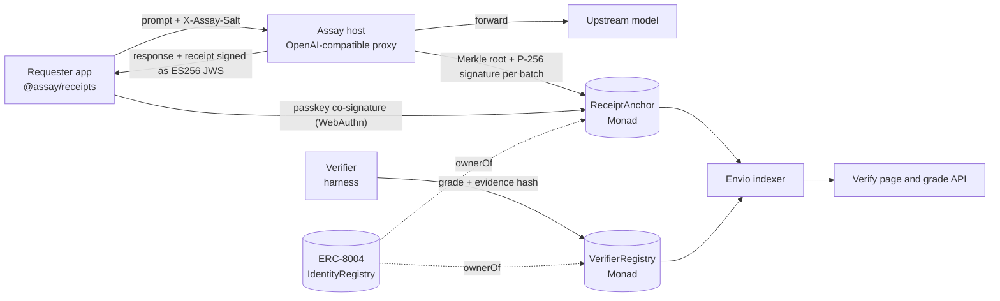

# Assay

A certificate of origin for every AI response.

## The problem

When you call an open-weight model like GLM-5.3 through someone else's host, the text comes back with no proof of where it came from.

The hosts don't all serve the same thing. On 26 Sep 2026, OpenRouter's API listed 37 distinct endpoints for GLM-5.3. Sixteen of them didn't state their precision, and eight declared 4-bit. Output prices ranged from $1.19 to $8.80 per million tokens, and advertised context went from 262K to 1.31M tokens.

The same weights also score differently depending on who serves them. Olly measured DeepSeek V4 Flash at 90% on GPQA through DeepSeek's own API and at 75% on DigitalOcean. Cline measured GLM-5.2 at 74.2% on CoreWeave and 61.8% on OpenRouter's default routing. Glama, an AI gateway, delisted every third-party host because "some of them are obviously lying about their quantization".

The checks that exist today stay inside the place that made them. OpenRouter grades hosts for OpenRouter traffic, and Moonshot and MiniMax check hosts of their own models. None of it travels with the output.

## What Assay does

Every response gets a receipt. The host signs it with a P-256 key (or secp256k1 for AntSeed-style hosts), and the person who asked can co-sign it with a passkey. Monad checks both signatures onchain through its P256 precompile. Only salted hashes of the prompt and output go onchain, so you can later prove where an output came from without showing the prompt.

Anyone can register as a verifier with an ERC-8004 identity. Verifiers test hosts against the lab's own endpoint and publish grades with confidence intervals and the raw logs behind them. Apps decide which verifiers they trust.

An Envio indexer serves grade history and drift, so a gateway, marketplace or agent can check a host with a single call.

The full format is in [SPEC.md](SPEC.md).

## Who it's for

Agents and apps that buy inference from hosts they don't control can attach receipts and check grades before they pay. Marketplaces and gateways like AntSeed, Surplus and Glama can route on grades without building their own testing team. Open-weight labs get neutral coverage of every host, including the ones they never got around to testing. And anyone publishing AI output gets a receipt that still works after the text is copied somewhere else.

## Why Monad

Assay leans on three things Monad provides natively.

The P256VERIFY precompile at `0x0100` (EIP-7951) checks P-256 signatures for 6,900 gas. Passkeys, cloud KMS keys, HSMs and Intel TEEs all sign with P-256, so a host key and a requester's passkey can both be verified onchain directly. Without the precompile, OpenZeppelin's Solidity fallback costs about 250,000 gas for the same check. Our tests pin the EVM version and include a gas-bound test that fails if the fallback ever runs instead of the precompile.

ERC-8004 identity is deployed as a first-class registry on Monad. Every host and verifier in Assay is an ERC-8004 agent, and the contracts check `ownerOf` against that registry instead of running their own account system.

Gas is cheap enough to anchor small batches often. One `anchor()` call uses about 61,000 gas, which is roughly 0.006 MON at the minimum base fee. Spread over a 64-receipt batch, that's about 0.0001 MON per receipt. A passkey co-signature (`cosign()`) uses about 73,000 gas.

## Status (3 Oct 2026)

| Piece | State |
|---|---|
| Contracts (`ReceiptAnchor`, `VerifierRegistry`, `CreAttestor`) | 99 tests, plus 3 that run against the real ERC-8004 registry on a testnet fork |
| Testnet deploy | `ReceiptAnchor` and `VerifierRegistry` live and verified, first anchor onchain. See [deployments](docs/deployments.md). `cosignK` and `CreAttestor` are built and tested but not deployed yet |
| `@assay/receipts` SDK | 110 tests: receipts, salted commits, signing, Merkle batches, `verifyReceipt` with a `reproduce` line per check, passkey helpers, `wrap(fetch)`, `gradeOf` |
| Reference host (`host/`) | 35 tests: OpenAI-compatible proxy that signs every response, batches and anchors receipts, relays co-signatures |
| End to end | 16 of 16 checks on a local chain: request, signed receipt, onchain anchor, passkey co-signature, full verification. See [evidence](docs/evidence/e2e-local.txt) |
| Web app (`web/`) | 44 tests: verify page, ask and co-sign, grades, and a Mera vault for receipts and salts |
| Envio indexer (`indexer/`) | 16 handler tests: four contracts, host stats, drift events, leaderboards, key rotations |
| Grader (`harness/`) | 32 tests: probes hosts against the lab's endpoint, exports grades with a deterministic evidence bundle |
| Report v0 | Published in [report/](report/REPORT_v0.md) |
| Chainlink CRE workflow (`cre/`) | 27 tests: re-checks each grade's evidence and writes an attestation to `CreAttestor`. Compiles to WASM. Simulation and deployment need a Chainlink CRE account |

## Architecture



A request goes through the host, which forwards it to the model, computes salted commits of the prompt and the output, and returns the response together with a signed receipt. Every few minutes the host builds a Merkle tree of the receipts it issued and anchors the root on Monad with one P-256 signature. Anyone holding a receipt can then prove it was in an anchored batch, and the requester can add a passkey co-signature that the contract verifies through the precompile.

Grades live separately. Verifiers test each host against the lab's own endpoint and post the result, a 95% confidence interval and a hash of the raw logs. Readers choose which verifiers they trust when they call `gradeOf`, so nobody can flood the registry with fake grades that count.

The contracts are in `contracts/src`, the receipt format is in [SPEC.md](SPEC.md), and the deployed addresses are in [docs/deployments.md](docs/deployments.md).

## Tech stack

| Layer | What we use |
|---|---|
| Chain | Monad testnet (chain 10143), P256VERIFY precompile, ERC-8004 IdentityRegistry and ReputationRegistry |
| Contracts | Solidity 0.8.30, Foundry, OpenZeppelin Contracts 5.7.0 (`P256`, `WebAuthn`, `MerkleProof`) |
| SDK | TypeScript, viem, jose (ES256 JWS), canonicalize (RFC 8785), @openzeppelin/merkle-tree, vitest |
| Grader | Python 3 standard library, OpenRouter API |
| Indexing | Envio HyperIndex (four contracts, derived entities computed in handlers) |
| Requester keys | WebAuthn passkeys, Mera PRF-derived keys for the receipt vault and per-app identities |
| Host and web | Hono on Node 22, Vite with plain TypeScript |

## Repo layout

```
contracts/   Foundry: ReceiptAnchor, VerifierRegistry, CreAttestor, tests
sdk/         @assay/receipts: receipts, signing, Merkle, verify, passkeys, wrap(fetch), grades
host/        @assay/host: OpenAI-compatible proxy that signs and anchors receipts
harness/     assay_probe.py (the grader) and export_grade.py
indexer/     Envio HyperIndex: anchors, co-signatures, grades, drift, leaderboards
cre/         Chainlink CRE workflow that re-checks grades
web/         verify, ask and co-sign, grades, Mera vault
report/      open-weight hosting report
docs/        architecture, quickstart, threat model, adopters, integrations, deployments, evidence
gitbook/     the documentation site (GitBook, synced from this folder)
```

## Try the grader

The dry run needs no API key and prints the cost estimate before you spend anything.

```
cd harness
python3 assay_probe.py --model z-ai/glm-5.3 --dry-run
export OPENROUTER_API_KEY=sk-or-...
python3 assay_probe.py --model z-ai/glm-5.3 --reference z-ai --repeats 10
```

## Develop

You need Node 22 or newer, pnpm (`corepack enable`) and Foundry 1.7 or newer.

```bash
git clone --recurse-submodules https://github.com/trudransh/Assay.git
cd Assay
pnpm install

# contracts
cd contracts && forge test -vv && cd ..

# SDK
pnpm --filter @assay/receipts test
pnpm --filter @assay/receipts typecheck
```

The Solidity tests read vectors that the SDK generates, so the two sides can't drift apart. After changing anything about hashing, signing or Merkle trees, regenerate them and run both suites:

```bash
pnpm --filter @assay/receipts gen:vectors
cd contracts && forge test
```

Three tests run against the real ERC-8004 registry on a fork of Monad testnet. They're skipped in a plain `forge test` and run with:

```bash
cd contracts && forge test --match-path "test/fork/*" --fork-url monad_testnet -vv
```

To deploy your own copy, follow the steps in [docs/deployments.md](docs/deployments.md). Copy `.env.example` to `.env` for the host and indexer settings, and never commit `.env`.

## How this was built

Everything in this repository was written during Monad Metropolis. The grader in `harness/` and report v0 in `report/` were written in the last week of September, shortly before the first commit. Everything else, including the contracts, the SDK and the deployment, was built from 30 September onward, and the commit history shows that work day by day.

## Credits

Assay builds on these open-source projects:

| Project | Used for | License |
|---|---|---|
| [OpenZeppelin Contracts](https://github.com/OpenZeppelin/openzeppelin-contracts) 5.7.0 | `P256`, `WebAuthn`, `MerkleProof`, `Base64` | MIT |
| [forge-std](https://github.com/foundry-rs/forge-std) | Solidity tests and scripts | MIT / Apache-2.0 |
| [Foundry](https://github.com/foundry-rs/foundry) | Build, test, deploy | MIT / Apache-2.0 |
| [viem](https://github.com/wevm/viem) | Hashing, ABI encoding, chain access | MIT |
| [jose](https://github.com/panva/jose) | ES256 JWS signing and verification | MIT |
| [canonicalize](https://github.com/erdtman/canonicalize) | RFC 8785 canonical JSON | Apache-2.0 |
| [@openzeppelin/merkle-tree](https://github.com/OpenZeppelin/merkle-tree) | Merkle batches that match `MerkleProof` | MIT |
| [vitest](https://github.com/vitest-dev/vitest) | SDK tests | MIT |

The ERC-8004 registries on Monad testnet are the official deployments from [erc-8004/erc-8004-contracts](https://github.com/erc-8004/erc-8004-contracts). Third-party measurements quoted in the README and the report are credited where they appear.

## License

MIT
