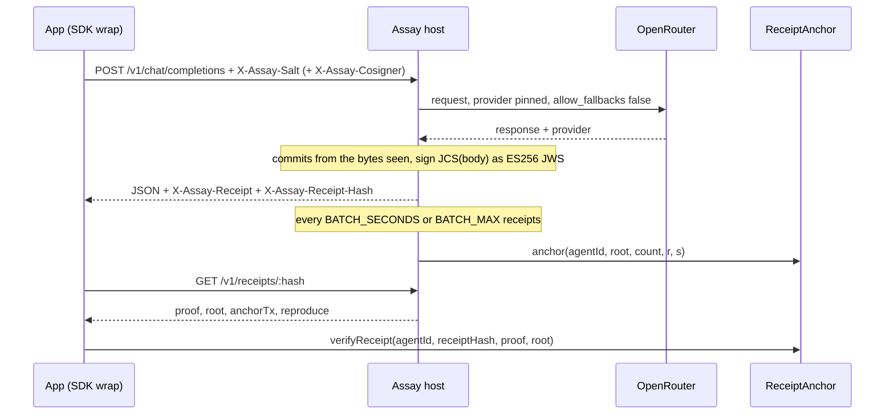

# Architecture

This page shows how the parts of Assay fit together and what happens to one request from start to finish. The receipt format itself is in [SPEC.md](../SPEC.md). Addresses are in [deployments.md](deployments.md).

## Components

| Component | Folder | What it does | Runs where |
|---|---|---|---|
| `@assay/receipts` SDK | `sdk/` | Builds and hashes receipts, computes commits, signs and checks JWS, builds Merkle batches, verifies receipts check by check, wraps `fetch`, reads grades | Node and browsers |
| Reference host | `host/` | OpenAI-compatible proxy in front of OpenRouter. Signs a receipt per response and anchors batches | A server |
| `ReceiptAnchor` | `contracts/src/ReceiptAnchor.sol` | Host keys, batch anchors, receipt inclusion checks, passkey and secp256k1 co-signatures | Monad testnet |
| `VerifierRegistry` | `contracts/src/VerifierRegistry.sol` | Verifier registration and grades, `gradeOf` filtered by the reader's trusted list | Monad testnet |
| `CreAttestor` | `contracts/src/CreAttestor.sol` | Stores Chainlink CRE re-checks of posted grades | Monad testnet |
| ERC-8004 IdentityRegistry | external, `0x8004A818…BD9e` | Identity of every host and verifier. Both contracts check `ownerOf` against it | Monad testnet |
| Grader | `harness/` | Tests hosts against the lab's own endpoint and exports grades with an evidence bundle | Anyone's machine |
| Indexer | `indexer/` | Envio HyperIndex over all of the contracts above. Computes drift, leaderboards, activity and key history | Envio Cloud or local Docker |
| Web app | `web/` | Verify, ask and co-sign, grades, and a Mera passkey vault | Browser |
| CRE workflow | `cre/` | Re-checks a grade's evidence on a Chainlink DON and writes the result to `CreAttestor` | Built and tested, not deployed |

## One request, step by step

1. The app wraps `fetch` with `wrap(fetch)` from the SDK. Each call gets a fresh 32-byte salt in `X-Assay-Salt`. If the requester plans to co-sign, `wrap(fetch, { cosigner })` also sends `X-Assay-Cosigner: <keyHash>`.
2. The host rejects the request with 400 if the salt is missing or not 64 hex characters, or if `stream` is true.
3. The host forwards the request to OpenRouter. When `UPSTREAM_PROVIDER` is set it pins that provider with `allow_fallbacks: false`.
4. If OpenRouter reports a different provider, or returns no assistant text, the host answers 502 and signs nothing.
5. The host computes `req.commit = sha256(salt ‖ JCS({messages, params}))` and `res.commit = sha256(salt ‖ output)` from the bytes it actually received and returned.
6. It builds the receipt body, signs `JCS(body)` as an ES256 JWS, and appends the receipt to `data/receipts.jsonl`.
7. It returns the upstream JSON with two headers. `X-Assay-Receipt` is base64url of `{body, jws}`, and `X-Assay-Receipt-Hash` is `sha256(JCS(body))`.
8. `wrap` parses the receipt, checks the hash header against the body and checks `res.commit` against the text it received. It returns the receipt and the salt, and the app keeps both.
9. Later, the batcher anchors the receipt (next section). `GET /v1/receipts/:hash` then returns the Merkle proof, the root, the anchor transaction and a ready `cast call` line.
10. Anyone holding the receipt runs `verifyReceipt()` from the SDK. Each check passes, fails or is skipped on its own, and each one comes with the exact computation or contract call that reproduces it.

## Batch anchoring

| Setting | Value | Source |
|---|---|---|
| Anchor interval | `BATCH_SECONDS`, default 300 | `host/src/config.ts` |
| Batch size cap | `BATCH_MAX`, default 64. The host anchors at once when this many receipts wait | `host/src/batcher.ts` |
| Empty queue | Never anchored. The contract also rejects `count == 0` | `batcher.test.ts`, `test_anchor_emptyBatch_reverts` |
| Gas limit | Estimate × 1.2, because Monad bills the gas limit | `host/src/batcher.ts` |
| RPC failure | One retry on `MONAD_RPC_URL_2`. Receipts stay queued if both fail | `batcher.test.ts` |
| Reverted transaction | Counted as a failure and not resent. Receipts stay queued | `batcher.test.ts` |
| Low balance warning | Relayer below 1 MON | `host/src/batcher.ts` |

The batcher builds an OpenZeppelin `StandardMerkleTree` over the pending receipt hashes. It signs `sha256(abi.encode(keccak256("assay-anchor/0"), chainid, anchorContract, agentId, root, count))` with the host's P-256 key. Any wallet can send the transaction, because the authority is the host's signature, not the sender.

`anchor()` checks the signature with the P256VERIFY precompile at `0x0100` and stores `anchors[agentId][root] = (count, anchoredAt)`. Anchors are keyed per host, so another host can't block or claim a batch by anchoring the same root first.

| Call | Gas (forge gas report, success path) |
|---|---|
| `setHostKey` | 74,877 |
| `anchor` | 61,430 |
| `verifyReceipt` (view) | about 3,600 |

At 64 receipts per batch, one anchor costs under 1,000 gas per receipt.

## Co-signing

A requester can add their own signature to an anchored receipt. It shows that the person holding the key asked for this response.

| Path | Key | Contract call | Gas |
|---|---|---|---|
| Passkey | P-256 WebAuthn credential, challenge = `receiptHash` | `cosign(agentId, receiptHash, proof, root, auth, qx, qy)` | 72,792 |
| Per-app key | secp256k1 key derived from the passkey's PRF output (Mera) | `cosignK(agentId, receiptHash, proof, root, signature)` with EIP-191 over `receiptHash` | 56,838 |

Both calls first check that the receipt is in an anchored batch of that host. Both store one record per key, so a stranger who co-signs first doesn't block the requester. The receipt body names the real requester in `req.cosigner`, and verifiers count only that key.

The SDK turns a browser assertion into the contract's `WebAuthnAuth` struct with `assertionToWebAuthnAuth`. That function converts DER to raw, normalizes `s` to the low half and computes the clientDataJSON indexes. The host can relay a passkey co-signature through `POST /v1/cosign`, limited to 10 per IP per hour, and only for receipts it issued and anchored.

## Grading

1. A verifier registers an ERC-8004 identity and calls `registerVerifier(agentId)`.
2. It runs `harness/assay_probe.py` against a model's hosts, with the lab's own endpoint as the reference. The probe pins each host and repeats each case.
3. `harness/export_grade.py` turns the run into one grade per host. Each grade has the pass count, a 95% Wilson interval in basis points and the sha256 of a deterministic evidence tarball.
4. The verifier calls `postGrade(grade)`. The registry re-checks ERC-8004 ownership on every post. It rejects `total == 0`, `passed > total`, an inverted or out-of-range interval, a future timestamp, and any grade not newer than the verifier's last one for the same model and host.
5. A reader calls `gradeOf(model, hostKey, trusted[])`. It returns the newest grade among the verifiers the reader trusts. The SDK's `gradeStatus` turns that into `pass`, `warn` (fewer than 30 samples), `unknown` (no grade, or older than 7 days) or `fail` (the host's upper bound is below the reference's lower bound).

A first `postGrade` for a (model, host) pair costs 195,885 gas, because it fills fresh storage slots.

`hostKey` follows identity, not the signing key: `keccak256("erc8004:<chainId>:<agentId>")` for an Assay host. A host that rotates its key keeps its grades.

## CRE re-check

A grade still comes from one verifier. The Chainlink CRE workflow in `cre/` re-checks it on a decentralized oracle network.

1. `GradePosted` on Monad testnet triggers the workflow.
2. Each node fetches the evidence bundle, checks its sha256 against the grade's `evidence` field, and recomputes `passed`, `total` and the Wilson interval from the raw logs.
3. The nodes reach consensus on one report.
4. The CRE forwarder calls `CreAttestor.onReport(metadata, report)`. The contract accepts only the configured forwarder and the pinned workflow owner (and workflow id, if set), then stores the attestation and emits `GradeAttested`.

A successful `onReport` costs up to 60,713 gas. The contract and its tests are done. `CreAttestor` is deployed on testnet. The workflow is built and tested, and it waits for a CRE account to simulate and deploy.

## Indexing

The Envio indexer in `indexer/` reads these events:

| Contract | Events |
|---|---|
| ReceiptAnchor | `HostKeySet`, `Anchored`, `Cosigned`, `CosignedK` |
| VerifierRegistry | `VerifierRegistered`, `GradePosted` |
| CreAttestor | `GradeAttested` |
| ERC-8004 IdentityRegistry | `Registered` |

Handlers compute derived entities at index time, so the GraphQL API only reads. `HostModelStats` holds the latest grade and pass rate. `DriftEvent` is written when a new grade's interval falls wholly below the previous one. `ModelLeaderboard` ranks hosts per verifier and model, and `HostActivity` counts anchors and co-signatures per day. `KeyRotation` links each anchor to the key that signed it. Agent cards are loaded from each agent's URI through Envio's Effect API. Every id is prefixed with the chain id (`10143-…`). The entity list and example queries are in [indexer/README.md](../indexer/README.md).

## Web app

`web/` is one Vite page with four tabs, built on the SDK.

| Tab | What it does |
|---|---|
| Verify | Paste a receipt and optionally the salt, output and messages. Runs `verifyReceipt` and shows every check with its reproduce line |
| Ask & co-sign | Registers a passkey, asks through the host with `wrap(fetch, {cosigner})`, waits for the anchor, co-signs and relays through `POST /v1/cosign` |
| Grades | Calls `gradeOf` for an agent id or an OpenRouter tag and shows the status, counts, interval and evidence hash |
| Vault | Mera passkey PRF with three namespaces: `assay:vault:v1` encrypts saved receipts and salts, `assay:requester:<appId>` derives a per-app secp256k1 key for `cosignK`, `assay:reveal:<receiptHash>` derives a key that opens one receipt only |

## What goes onchain

| Onchain | Never onchain |
|---|---|
| Host public keys, Merkle roots, batch sizes, timestamps | Prompts and outputs |
| Co-signer key hashes or addresses per receipt hash | Salts |
| Grades: counts, intervals, evidence hashes | Raw grading logs (published offchain, pinned by hash) |
